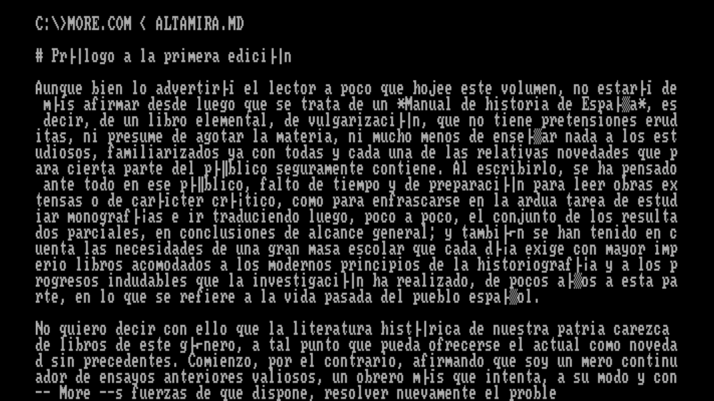

# Escritura en texto plano con Pandoc

Herramientas y configuración para escribir en Markdown —un lenguaje de marcado sencillo para texto plano— y convertirlo a PDF, Word, LaTeX, etc. mediante Pandoc generando documentos tipográficamente bien compuestos.


**Figura 1** Diagrama del sistema propuesto en este proyecto

## Dependencias externas

El repositorio es bastante autocontenido, pero hay dependencias mínimas sin las que nada funciona, y que hay que instalar. Una relación exhaustiva de las herramientas usadas se hace en [`herramientas`](docs/herramientas.md).

- [`pandoc`](https://pandoc.org/installing.html) con [`citeproc`](https://github.com/jgm/citeproc) (vienen empaquetados juntos)
- [`pandoc-crossref`](https://github.com/lierdakil/pandoc-crossref/releases/latest)
- Una distribución [`TeX`](https://ctan.org/starter) que incluya [`LuaTeX`](https://www.luatex.org/download.html)
- Las siguientes fuentes[^1]:
    1. *Serif*: [Arno Pro](https://fonts.adobe.com/fonts/arno) o [Source Serif 4](https://github.com/adobe-fonts/source-serif/releases/latest)
    2. *Sans*: [Myriad Pro](https://fonts.adobe.com/fonts/myriad) o [Source Sans 3](https://github.com/adobe-fonts/source-sans/releases/latest)
    3. Monoespaciada: [Source Code Pro](https://github.com/adobe-fonts/source-code-pro/releases/latest)
    4. Matemática: [IBM Plex Math](https://github.com/IBM/plex/releases/tag/%40ibm%2Fplex-math%401.1.0)

[^1]: La plantilla no está limitada a estas fuentes, son simplemente las que están declaradas por defecto. Se puede usar cualquier fuente instalada en el sistema declarando `mainfont`, `sansfont`, `monofont` y `mathfont` en el bloque YAML del documento, o modificando directamente la sección de fuentes de `memoir.tex`.

## Guía de uso rápido

1. **Coloca el repositorio en el directorio de datos de Pandoc.** La ubicación depende del sistema: en macOS y Linux es `~/.local/share/pandoc/` o `~/.pandoc/`; en Windows, `%APPDATA%\pandoc\`. Clónalo directamente en esa ruta:

    ```bash
    git clone --recurse-submodules https://github.com/carlos-llamedo/entorno-pandoc "$HOME/.local/share/pandoc"
    ```

2. **Comprueba que Pandoc lo está usando.** La salida del comando

    ```bash
    pandoc --version
    ```

    incluye una línea «User data directory: …» con la ruta desde la que Pandoc lee. Debe coincidir con la del paso anterior.

3. **Crea un archivo de bibliografía con Zotero.** Los preajustes `memoria` y `notas` exigen un archivo `biblioteca.json` en el directorio de datos. Expórtalo como se explica en [la sección «Archivo de bibliografía»](#archivo-de-bibliografía). Si no vas a citar, puedes cambiar los preajustes que lo usan o crear un `biblioteca.json` vacío.
4. **Genera un documento a partir de un archivo Markdown.**

    ```bash
    pandoc -d memoria "Documento.md" -o "Documento.pdf"
    ```

   `-d memoria` carga [`memoria.yaml`](defaults/memoria.yaml), que activa la plantilla, los filtros y la bibliografía. El resto de preajustes y su propósito se explican en [su sección correspondiente](#preajustes).

Con esto se genera un documento básico, pero lo normal es que se quiera ajustar el aspecto del resultado. Lo que se declara en los preajustes que se cargan es inamovible, tiene preferencia sobre todo lo demás, por lo que están pensados para cubrir el mínimo necesario. Hay que consultar las opciones que ofrecen los [filtros](docs/filtros.md) y la [plantilla](docs/plantilla.md), y declarar las que se quieran cambiar al principio del documento, entre dos líneas que solo contengan `---`. El manual de Pandoc contiene [una sección](https://pandoc.org/MANUAL.html#extension-yaml_metadata_block) en la que se explica más en detalle esto, pero vamos a poner aquí un breve ejemplo.

Quieres usar Times New Roman como fuente del documento, que los enlaces destaquen con un color distinto, que en los metadatos aparezca tu nombre y que las llamadas a nota al pie de las referencias se sitúen antes de los signos de puntuación (sistema francés). Estas opciones se corresponden con las variables `mainfont`, `colorlinks`, `author` y `notes-after-punctuation`. `colorlinks` y `notes-after-punctuation` son variables booleanas, por lo que solo se puede activar (`true`) o desactivar (`false`). `mainfont` y `author` esperan cadenas de caracteres, por lo que hay que escribir exactamente lo que se quiere con ellas. Lo metemos todo entre dos líneas que contengan los caracteres `---` y este sería el resultado:

```markdown
---
mainfont: Times New Roman
colorlinks: true
author: Carlos Llamedo
notes-after-punctuation: false
---

Aquí empieza el texto normal del documento.
```

## ¿Por qué existe este proyecto?

Si escribes con regularidad (para tus alumnos, para tus clientes, para ti mismo) probablemente uses Word. Seguramente, además, no se te ocurran muchas otras formas de escribir un texto a ordenador y tener al final un documento presentable. Este estándar *de facto* tiene difícil justificación técnica. Es cierto que otras alternativas son más complejas —o, por lo menos, lo parecen en primera instancia—. Pero tal vez valga la pena preguntarse por qué Word nos resulta tan familiar y sus alternativas tan extrañas, y si la forma en que compone documentos es realmente la única posible o la mejor.

### Los procesadores de texto son estúpidos e ineficientes

Lo que hace Word es dar solución a la práctica generalizada de la autoedición. Todos creamos nuestros propios documentos, en principio, listos para imprimir —ya sea como `.docx` o exportándose a PDF—. La inmensa mayoría de lo que escribimos no pasa —ni de nuestra mano ni de la de un tercero— por *software* especializado de maquetación, que queda relegado únicamente a la edición profesional[^2]. Nuestros procesadores de texto, con cincuenta años de historia de desarrollo[^3], son suficientemente sofisticados como para que consideremos que nuestras necesidades tipográficas están, en general, cubiertas. Pero propiciar una cultura de autoedición digital masiva requería herramientas al alcance de cualquier persona. Herramientas donde la pantalla imitase a la página, y donde el escritor viese en todo momento cómo iba a quedar el documento. En nuestros documentos Word estamos escribiendo y maquetando al mismo tiempo: el paradigma que describe este modelo es que *lo que ves es lo que hay* (o, como se conoce por su acrónimo en inglés, WYSIWYG, *What You See Is What You Get*).

[^2]: Fundamentalmente mediante Adobe InCopy e InDesign, y, anteriormente, QuarkXPress.

[^3]: En 1976 se lanzó Electric Pencil. También fueron populares en esa época WordStar (1978), en el que [George R. R. Martin sigue escribiendo en su MS-DOS](https://www.youtube.com/watch?v=X5REM-3nWHg), y WordPerfect (1979).

Empecemos por evaluar las *bondades* del principio WYSIWYG. Se ha hecho ya referencia a su accesibilidad: no requiere aprender sintaxis de ningún lenguaje de marcado y la interfaz es reconocible porque es algo que todos conocen —una hoja de papel—. Al ver el resultado mientras se trabaja, se pueden tomar decisiones sobre la marcha y detectar problemas de presentación inmediatamente —aunque, como argumentaré, esto puede ser algo negativo—. Y, desde luego, para un tipo de documento *ad hoc* que no se va a reutilizar (como una carta o un *curriculum*), un programa WYSIWYG es la solución más eficiente. Hay un argumento que no es técnico, sino social, y seguramente sea el que tiene más peso: el de popularidad. Todo el mundo usa Word y el formato `.docx`, es lo que espera poder enviar y, desde luego, recibir; y también es la herramienta estándar para colaborar en línea sobre un mismo documento con herramientas como Word en Web o Google Docs.

Hablemos ahora de lo que Allin Cottrell, en su artículo *Word Processors: Stupid and Inefficient* (que da nombre a esta sección) llama las *maldades* de WYSIWYG[^4]. *Maquetar* y *escribir* son dos actividades intelectualmente distintas: un texto tiene *forma* y *contenido*; *presentación* por un lado y *estructura* y *formato* (lo que podríamos llamar *elementos funcionales*[^5]) por el otro. Un programa WYSIWYG como Word elimina completamente esta división, invitando a tratar al documento como una página digital donde forma y contenido son lo mismo. Anima al autor a mezclar función textual («esto es un título de sección») y aspecto visual («los títulos de sección deberían ir en negrita»), lo que distrae y tiene riesgos reales, como el paradigmático «síndrome del índice manual en Word» que describe Cottrell.

[^4]: Allin Cottrell, *Word Processors: Stupid and Inefficient*, 1999, <http://cda.psych.uiuc.edu/latex_class_material/wp.html>.

[^5]: En el ámbito del marcado de documentos y HTML, estos elementos se denominan habitualmente *semánticos*, por oposición a los elementos meramente *presentacionales*.

Pongamos que tienes un escrito y quieres señalar que algo es el título de una sección. Tienes bastante claro que tiene que destacar, y, dado que estás en un programa WYSIWYG, asumes que función semántica y aspecto visual son lo mismo (tratas el documento como un papel digital), y simplemente le aplicas *formato directo*: seleccionas el texto, lo pones en negrita y lo haces algo más grande. Haces esto con varios títulos, porque es un documento largo. Y, al final del todo, cuando le das los retoques de formato finales, quieres añadir un índice. No hay nada en tu documento que identifique funcionalmente a los títulos, solo visualmente, por lo que el índice no se puede construir automáticamente. Así que recurres a hacer un índice manual, una tarea tediosa y cuyo resultado nunca es del todo consistente. Tampoco podrías, de manera sencilla, cambiar el formato a todos los títulos a la vez, o numerarlos automáticamente. Hay una manera fácil de hacer esto en Word, que es usando los distintos estilos de texto que sí dan información funcional al texto, y no solamente visual. Pero como *lo que ves es lo que hay*, mucha gente asume que eso es *todo lo que hay*, y el sistema de estilos resulta contraintuitivo.

Produce, además, documentos peor maquetados por varios motivos. El primero es que se delegan decisiones de maquetación al escritor, algo sobre lo que no tiene por qué tener conocimiento alguno. Es común, por ejemplo, ver documentos donde se usan, a la vez, sangrías en primera línea en los párrafos y espaciado entre los mismos. Son dos soluciones distintas a un mismo problema tipográfico: cómo señalar visualmente dónde termina un párrafo y empieza el siguiente; usar las dos a la vez es redundante, e indica que quien tomó la decisión no entendía para qué sirve ninguna de las dos. Los documentos generados por un programa WYSIWYG también son peores a un nivel técnico de composición tipográfica. Word tiene que componer texto en tiempo real, lo que le obliga a hacer cálculos de composición con algoritmos rápidos —lo suficiente como para recalcular el párrafo en cada pulsación de tecla—, no necesariamente mejores. Tiene que usar algoritmos de composición de línea relativamente simples por este motivo, que generan muchos más ríos que, por ejemplo, el algoritmo Knuth-Plass que usa TeX.

El propio tipo de archivo que generan estos programas tiene sus problemas. El antiguo `.doc` de Word, por ejemplo, era un formato binario privativo de Microsoft (nunca documentado públicamente), dependiente de *software* específico para recuperar su contenido[^6]. A partir de 2007, con el formato `.docx` (y su equivalente abierto `.odt`), los documentos pasan a ser unos cuantos archivos marcados con XML y empaquetados juntos. Eso hace que, en principio, cualquier programa de descompresión los pueda extraer y leer, pero el fichero resultante es bastante verboso y conseguir solamente el texto es una tarea costosa. Además, aunque `.docx` está publicado como estándar ISO, la especificación es tan compleja y depende tanto de comportamientos propios de Word que ningún otro programa lo implementa por completo. No es exactamente que tus documentos sean una caja negra, completamente inusables sin usar Word, pero desde luego están tras una barrera de *software* relativamente compleja, lo que introduce cierta dependencia del proveedor[^7].

[^6]: Era, además, bastante proclive a corrupción, e implicaba aquellos infames problemas de legibilidad entre versiones de Word.

[^7]: Este fenómeno se conoce mejor por su forma inglesa, *vendor lock-in*. En él, un usuario u organización depende de un proveedor concreto (en este caso, Microsoft) para acceder a sus propios datos o continuar usando un servicio, con un elevado coste de cambio a la alternativa.

* * *

|   |   |
|---|---|

**Figuras 2.1-2** Tres párrafos de contenido en un archivo `.docx` desempaquetado (los archivos [`word/document.xml`](examples/document.xml) y [`word/footnotes.xml`](examples/footnotes.xml), respectivamente)[^8]. Word almacena el cuerpo del texto y las notas al pie en archivos XML separados. El contenido es difícilmente legible, y el formato aún más.

[^8]: El texto de ejemplo es un fragmento del prefacio a la primera edición de la *Historia de España y de la civilización española* de Rafael Altamira (4 vols., Barcelona, 1900-1911).

* * *

Sin perjuicio de lo anterior, quiero reiterar que no pienso ni que los procesadores de texto sean mal *software*, ni que deberíamos evitar usarlos a toda cosa —dada su popularidad, por otro lado, sería imposible—. Hay situaciones, como ya hemos discutido, donde son simplemente la mejor opción. Y hay una (reducida) selección de procesadores competentes: Word, Pages, Google Docs, y Writer (de LibreOffice y OpenOffice) cubren, en general, cualquier necesidad. Scrivener es una solución híbrida que merece una mención aparte. La cuestión no es, como señala Kieran Healy[^9], si puedes o no llevar a cabo trabajo sostenible y de buena calidad con otras herramientas —eso se puede hacer hasta en una máquina de escribir—, sino que merece la pena dedicarse, aunque sea mínimamente, a pensar en cómo llevas a cabo tu trabajo.

[^9]: Kieran Healy, *The Plain Person’s Guide to Plain Text Social Science*, 4 de octubre de 2019, <https://plain-text.co/>.

### Hay mundo más allá de Word

A pesar de todo, sí hay alternativa al procesador de texto. Para encontrarla habría que retroceder en la historia de la computación más allá de Word, más allá de las interfaces gráficas, más allá incluso de los ordenadores personales. La codificación de caracteres en un fichero, la informática en su forma más elemental: el texto plano.

Un archivo de «texto simple» o «texto plano»[^10] es una secuencia de caracteres codificados según una convención común. A diferencia de un archivo binario —un `.docx`, un PDF—, no requiere de un programa para leerse; cualquier persona con una máquina que entienda la codificación es capaz de ello. Esa codificación está estandarizada desde 1963: primero con ASCII, limitado al inglés, y a lo largo de los años 90, con Unicode, que amplió el repertorio a prácticamente todas las lenguas manteniendo la retrocompatibilidad. El resultado es que un archivo de texto plano escrito hoy en UTF-8 será perfectamente legible dentro de sesenta años, igual que lo es hoy uno escrito en ASCII en un IBM PC del 83.

[^10]: Esta forma, calco del inglés *plain text*, es preferible frente a «texto simple», que es más ambigua al poder confundirse con «texto sin complejidad».

* * *


**Figura 3** El texto de ejemplo en un Markdown UTF-8 leído con `more` en [DOSBox](https://www.dosbox.com/) emulando un IBM PC con DOS. Los caracteres fuera del rango ASCII se muestran como *mojibake* (glifos CP437); el resto es perfectamente legible.

* * *

El texto plano resuelve el problema de la dependencia del *software*, pero no el de los *elementos funcionales* del texto. Uno podría abrir el Bloc de notas de Windows y ponerse a escribir, y se daría cuenta rápidamente de que necesita indicar *estructura* y *formato* de alguna forma. Qué es un párrafo y qué no. Qué marca la cursiva, o una lista. Cómo convertirlo, en definitiva, en *texto plano formateado*; en un *documento estructurado*, donde *lo que ves* no es *lo que hay*, sino *lo que quieres decir* (WYSIWYM, *What You See Is What You Mean*). Nada impide inventarse sobre la marcha una convención propia, pero hay ventajas en aprender una que ya existe. Suelen estar bien diseñadas, cubren prácticamente todos los casos imaginables y, sobre todo, son interoperables con otras herramientas.

Los primeros que se enfrentaron a este problema y que dieron una respuesta fueron los miembros de la comunidad científico-técnica. Los procesadores de texto de la época eran bastante aparatosos a la hora de representar fórmulas matemáticas complejas (lo siguen siendo a día de hoy), y la solución fue la creación de los *lenguajes de marcado*. TeX, creado por Donald Knuth en 1978, y su derivado LaTeX, de Leslie Lamport en 1984, llevan décadas siendo el estándar en matemáticas, física e ingeniería. HTML, publicado por Tim Berners-Lee en 1991, es la sintaxis sobre la que está construida la web. Ambos son potentes, pero algo tediosos de escribir y difíciles de leer sin renderizar. Por ese motivo John Gruber se propuso en 2004 crear un *lenguaje de marcado ligero* con el objetivo declarado de evitar esa verbosidad, que recogiera las convenciones informales que ya circulaban en Internet —el uso de asteriscos para enfatizar, de guiones para listar, de almohadillas para encabezar— y las formalizara en una sintaxis que fuera legible directamente. El resultado fue **Markdown**. Sencillo de escribir y de leer, el archivo fuente se parece al resultado, y es más que suficiente para la inmensa mayoría de lo que se escribe en un procesador de texto.

* * *

|   |   |  ![Captura de VSCode con el archivo `altamira.md`. El texto fuente en Markdown, con un encabezado, cursivas marcadas con asteriscos, una cita en sintaxis [@clave], un *span* con versalitas y una nota al pie con un hipervínculo.](examples/Markdown.png) |
|---|---|---|

**Figuras 4.1-3** Comparativa del mismo fragmento marcado con [LaTeX](examples/altamira.tex), [HTML](examples/altamira.html) y [Markdown](examples/altamira.md), respectivamente.

* * *

### Las virtudes de Markdown

Escribir en Markdown es la alternativa que hace el trabajo más sostenible, reproducible y duradero, y la que, en última instancia, devuelve el control al autor. La sencillez y racionalidad del sistema permite a programas como Pandoc convertir los documentos a cualquier otro formato —PDF, Word, HTML, LaTeX— desde el mismo archivo fuente. Las decisiones de maquetación quedan delegadas a una plantilla y las referencias bibliográficas a un procesador de citas, lo que tiende a producir resultados tipográficamente mejores y permite cambiar el estilo visual del documento o el formato de las citas de forma trivial. El sistema escala además cuando hace falta: el Markdown de Pandoc[^11], junto con filtros como pandoc-crossref, cubre prácticamente cualquier necesidad de escritura, y donde no llega —una fórmula matemática, una tabla particularmente compleja—, siempre es posible introducir LaTeX directamente.

[^11]: El Markdown de Pandoc es uno de los dialectos más capaces del formato. A diferencia del Markdown original de Gruber, pensado principalmente para generar HTML, el de Pandoc está diseñado para producir cualquier tipo de documento: admite notas al pie, citas bibliográficas con sintaxis `[@cita]` procesadas por Citeproc, listas de definiciones, bloques de metadatos YAML, y *divs* y *spans* con atributos arbitrarios que permiten pasar información a los filtros o a la plantilla de salida.

* * *


**Figura 5** [PDF](examples/altamira.pdf) generado a partir del texto de ejemplo con la plantilla `memoir.tex`. Encabezados a página par e impar, números de página con cifras elzevirianas, notas al pie numeradas, versalitas e hipervínculos en color sin que el autor haya tomado una sola decisión de maquetación.

* * *

Hay dos ventajas más que conviene señalar explícitamente, porque no son evidentes. La primera es la independencia del trabajo respecto de la herramienta. Con un archivo Markdown puedes trabajar desde Zettlr, Obsidian, Emacs o el Bloc de notas de Windows. No hay dependencia de ningún programa concreto, y cambiar de herramienta no implica cambiar de formato ni perder nada. Todas las herramientas de este sistema son además gratuitas y de código abierto. No hay coste de acceso, funcionan en todos los sistemas operativos principales y, al estar mantenidas por comunidades activas, ofrecen garantías a largo plazo. Esto refuerza también la segunda virtud, que es la conservación y la archivística digital. Kepano, el fundador de Obsidian, [sugirió una vez](https://obsidian.md/blog/new-obsidian-icon) que, si quieres que tus archivos se puedan leer en 2060 o en 2160, tal vez convenga empezar a pensar en archivos que se podrían leer en 1960. Lo que se crea son documentos ligeros, consistentes, portátiles y legibles sin ningún *software* específico[^12]. Paradójicamente, una vez configurado es bastante más sencillo de usar que navegar por infinitos submenús en Word. Tal vez nunca ha sido verdad que *hic sunt leones*.

[^12]: Para quien trabaje con control de versiones, el texto plano se integra de manera natural con herramientas como Git.

* * *

![Captura de Zettlr mostrando el mismo documento en su vista de edición con previsualización en línea. El encabezado y las cursivas aparecen ya formateados, y la cita [@clave] se renderiza como «(Altamira y Crevea 1895)».](examples/Zettlr.png)
**Figura 6** El mismo texto de ejemplo abierto en Zettlr, un editor de Markdown. El formato se renderiza en la propia vista de edición —incluida la cita, ya formateada— sin que el texto deje en ningún momento de ser un archivo de texto plano.

* * *

Dicho todo esto, sería deshonesto, si no directamente inescrupuloso, no mencionar los inconvenientes de este enfoque. Evidentemente, requiere aprender una forma de tratar el texto distinta de a la que Word nos tiene acostumbrados —el coste de cambio es, al fin y al cabo, una característica del oligopolio—. Guardar y organizar archivos requiere de un conocimiento del ordenador y de una disciplina de la que no todo el mundo dispone. Las imágenes, a diferencia de en un `.docx`, no están incrustadas en Markdown, sino referenciadas desde un directorio. Y los casos más complicados, que exigen por ejemplo recurrir a LaTeX crudo, rompen el agnosticismo que permite al documento convertirse a otro formato de forma limpia. No son cuestiones triviales, pero tampoco lo son las ventajas —control, durabilidad, portabilidad y calidad tipográfica difícilmente alcanzables con un procesador de texto—.

## Organización del proyecto

### Documentación

El directorio [`docs/`](docs/) contiene la documentación técnica de consulta:

- [`referencias`](docs/referencias.md). Dónde está la documentación oficial de cada componente.
- [`herramientas`](docs/herramientas.md). Qué es cada herramienta, cómo instalarla y cómo se relaciona con el resto del flujo de trabajo.
- [`plantilla`](docs/plantilla.md). Qué variables variables YAML contempla `memoir.tex`.
- [`filtros`](docs/filtros.md). Qué filtros se usan, para qué sirven, cómo usarlos y qué variables YAML modifican su comportamiento.
- [`markdown`](docs/markdown.md). Guía de estilo de Markdown, extensiones de Pandoc activas en este flujo y qué hacen.

### Plantillas

El directorio [`templates/`](templates/) contiene las plantillas que Pandoc usa para generar los documentos.

- [`memoir.tex`](templates/memoir.tex) es la plantilla principal. Está diseñada para memorias académicas con la clase `book` de LaTeX y es compatible con todos los preajustes que generan PDF. Sus variables, declarables en el encabezado YAML de cada documento, están documentadas en [`plantilla`](docs/plantilla.md).
- [`dunning.tex`](templates/dunning.tex) es una plantilla ligera basada en la clase `tufte-handout`, útil para documentos breves con notas al margen. Obra de Andrew Dunning.

El repositorio incluye también los archivos XML para construir `memoir.odt`, una plantilla para documentos ODT con aspecto parecido al de los PDF generados por `memoir.tex`. Los formatos `.odt` y `.docx` son archivos XML comprimidos; el directorio [`odt/`](templates/odt/) contiene esos archivos, que hay que empaquetar manualmente en `memoir.odt` y colocar en [`templates/`](templates/). El archivo construido **no se incluye en el repositorio** por ser un binario.

### Filtros Lua

El directorio [`filters/`](filters/) contiene los filtros Lua que transforman el documento durante la compilación. [`referencias`](docs/referencias.md) incluye dónde buscar la documentación exhaustiva de los filtros de terceros, aunque una guía de uso básica, tanto de los propios como de los ajenos, se da en [`filtros`](docs/filtros.md).

- [`include-files.lua`](filters/include-files.lua). Permite [transcluir](https://es.wikipedia.org/wiki/Transclusi%C3%B3n) archivos Markdown, lo que facilita dividir textos largos en varios archivos. De [Albert Krewinkel](https://github.com/pandoc-ext/include-files).
- [`multibib.lua`](filters/multibib.lua). Genera bibliografías múltiples y separadas en lugar de una única en un documento Markdown. De [Albert Krewinkel](https://github.com/pandoc-ext/multibib).
- [`noindent.lua`](filters/noindent.lua). Convierte *divs* con clase `.noindent` en bloques LaTeX sin sangría de primera línea. Útil para indicar cuándo un párrafo tras una lista o una cita exenta es continuación del anterior, y no uno nuevo.
- [`correcciones-notas.lua`](filters/correcciones-notas.lua). Aplica correcciones tipográficas del español dentro de las notas al pie construidas por `citeproc`: sustituye `párr.`, `sec.` y `secs.` por `§` para conservar el signo ortográfico y normaliza las semirrayas (anglicismo ortográfico) en rangos numéricos, convirtiéndolas a guiones.
- [`zotero.lua`](filters/zotero.lua). Permite convertir la [sintaxis de la extensión `citations` de Pandoc](https://pandoc.org/MANUAL.html#citation-syntax) a campos de cita de Zotero en archivos `.odt` y `.docx`, tal y como si se hubieran insertado con la [extensión de procesadores de texto de Zotero](https://www.zotero.org/support/word_processor_integration)[^13]. De [Emiliano Heyns](https://github.com/retorquere/zotero-better-bibtex/blob/master/site/content/exporting/zotero.lua).

[^13]: Tal como [documenta Heyns](https://retorque.re/zotero-better-bibtex/exporting/pandoc/index.html#from-markdown-to-zotero-live-citations), LibreOffice Writer tiene un *bug* que impide reconocer las citas en archivos `.docx`, por lo que hay que usar `.odt`. Si se usa Microsoft Word, no hay ningún problema con las citas en los `.docx`.

### Referencias bibliográficas

En lugar de formatear manualmente las citas, `citeproc` es capaz de generar referencias en texto junto con su bibliografía en cualquier estilo. Lo único que necesita es un documento con referencias en la [sintaxis de la extensión `citations` de Pandoc](https://pandoc.org/MANUAL.html#citation-syntax); un [archivo de bibliografía](https://pandoc.org/MANUAL.html#specifying-bibliographic-data) en uno de los formatos admitidos (BibLaTeX, BibTeX, CSL JSON, CSL YAML o RIS); y, si se quiere, un [archivo de estilo CSL](https://www.zotero.org/styles) (si no se indica, se usa *Chicago* autor-fecha).

#### Archivo de bibliografía

La gestión de bibliografía se apoya en [Zotero](https://www.zotero.org/) con [Better BibTeX](https://retorque.re/zotero-better-bibtex/). A través de ellos se genera y mantiene actualizado el archivo `${USERDATA}/biblioteca.json`, una exportación global de toda la biblioteca en formato CSL JSON que algunos preajustes —como [`memoria.yaml`](defaults/memoria.yaml) o [`notas.yaml`](defaults/notas.yaml)— requieren. La justificación de esta decisión está en [`herramientas`](docs/herramientas.md).

El archivo `biblioteca.json` no se incluye en el repositorio, pero **cada usuario tienen que crear su propia exportación** en el directorio de datos de Pandoc.

#### Archivos de estilo CSL y de localización

El directorio [`csl/`](csl/) contiene los estilos de citación y el directorio [`locales/`](locales/) los archivos de localización (léase «traducción»).

Ambos forman parte del estándar [Citation Style Language](https://citationstyles.org/), que es el sistema que usa `citeproc` para formatear las referencias. Se toman del [repositorio oficial](https://github.com/citation-style-language/styles) los más habituales en humanidades y ciencias sociales[^14].

[^14]: Se pueden encontrar más fácilmente en <https://www.zotero.org/styles>.

Las [localizaciones](https://github.com/citation-style-language/locales) adaptan los estilos al idioma del documento: traducen cadenas fijas como «ed.», «vol.» o «et al.» y aplican las convenciones tipográficas propias de cada lengua. Sin el archivo de localización correspondiente, `citeproc` recurre al inglés estadounidense por defecto.

### Preajustes

El directorio [`defaults/`](defaults/) contiene archivos preconfigurados para tareas específicas.

- [`memoria.yaml`](defaults/memoria.yaml). La opción por defecto: toma un documento Markdown, lo convierte a LaTeX y lo compila con LuaTeX para convertirlo en un PDF.
- [`multibib.yaml`](defaults/multibib.yaml) es un caso anejo a `memoria.yaml`. Se usa cuando, en lugar de un único bloque de referencias bibliográficas, se considera oportuno dividirlas en secciones distintas. En lugar de `citeproc` usa `multibib.lua`.
- [`odt.yaml`](defaults/odt.yaml) genera un documento ODT (un formato abierto equivalente al `.docx` de Microsoft Word) parecido a los PDF generados a partir de `memoir.tex`.
- [`biblio.yaml`](defaults/biblio.yaml) toma un archivo de bibliografía (BibLaTeX, CSL JSON, etc.) y lo formatea en un PDF a partir de `memoir.tex`. El estilo usado es *Chicago* autor-fecha. Usa `zotero.lua`.
- [`notas.yaml`](defaults/notas.yaml). Ocasionalmente es útil saber cómo formatea `citeproc` una referencia, sobre todo en nota. Este preajuste no genera ningún archivo, sino que está pensada para devolver en Markdown cómo se formatea una cita en estilo *Chicago* notas-bibliografía[^15].

[^15]: Escribir en la consola
    ```bash
    pandoc -d notas.yaml <<< "[@Ward-Perkins2005]"
    ```
    
    devuelve
    
    ```markdown
    [^1]
    
    :::: {#refs .references .csl-bib-body .hanging-indent}
    ::: {#ref-Ward-Perkins2005 .csl-entry}
    Ward-Perkins, Bryan. *The Fall of Rome and the End of Civilization*.
    Oxford University Press, 2005.
    :::
    ::::
    
    [^1]: Bryan Ward-Perkins, *The Fall of Rome and the End of Civilization*
        (Oxford University Press, 2005).
    ```

### *Scripts*

El directorio [`scripts/`](scripts/) contiene utilidades de mantenimiento y actualización:

- [`actualizar-csl.sh`](scripts/actualizar-csl.sh). Descarga las versiones más recientes de los estilos CSL incluidos en el repositorio desde el repositorio oficial de Citation Style Language.
- [`actualizar-locales.sh`](scripts/actualizar-locales.sh). Hace lo propio con los archivos de localización.

## Proyectos similares

- [`pandoc-templates`](https://github.com/jgm/pandoc-templates), el propio repositorio de las plantillas que usa Pandoc. Se incluye [como submódulo](templates/pandoc-templates/).
- [`pandoc-templates`](https://github.com/kjhealy/pandoc-templates) de Kieran Healy. Se incluye [como submódulo](templates/kjhealy/).
- [`Technical-Markdown`](https://github.com/gabyx/Technical-Markdown) de Gabriel Nützi.
- [`phd_thesis_markdown`](https://github.com/tompollard/phd_thesis_markdown) de Tom Pollard.
- [`pandoc-scholar`](https://github.com/pandoc-scholar/pandoc-scholar) de Albert Krewinkel.

## Derechos

Este repositorio está bajo una [licencia MIT](LICENCE.md), Copyright © 2026 Carlos Llamedo.

El archivo [`NOTICES`](licences/NOTICES.md) hace un inventario completo de los derechos que aplican a cada uno de las herramientas del flujo de trabajo, que son libres y abiertas. De ellas, sin embargo, hay que señalar las que se incluyen directamente en este repositorio, y que tienen su texto legal en [`licences/`](licences/):

|  Archivo |  Autor |  Licencia |
|---|---|---|
|  `include-files.lua` |  Albert Krewinkel |  [MIT](licences/MIT.md) |
|  `multibib.lua` |  Albert Krewinkel y contribuidores |  [MIT](licences/MIT.md) |
|  `zotero.lua` |  Emiliano Heyns |  [MIT](licences/MIT.md) |
|  `csl/` |  Citation Style Language |  [CC BY-SA 3.0 Unported](<licences/CC BY-SA 3.0 Unported.md>) |
|  `locales/` |  Citation Style Language |  [CC BY-SA 3.0 Unported](<licences/CC BY-SA 3.0 Unported.md>) |

Se trata de material de terceros con términos de uso propios, sobre el que este repositorio no reclama derechos.
